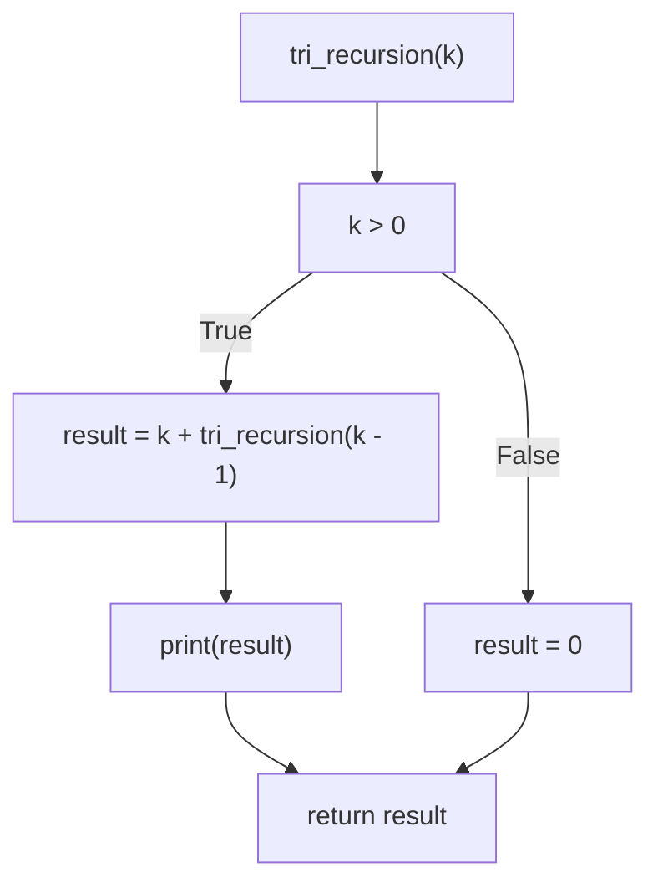

> **I don't see how a world that makes such wonderful things could be bad.**

# What are Mermaid Charts?
[Mermaid charts](https://mermaid.js.org/) are a fantastic free visualization tool built in JS to and designed to work with markdown. The charts are text based so you type what you want to visualize and they are compatible with a variety of tools that support markdown. Most importantly for people like me who use a lot of Microsoft tools Mermaid is supported in Loop components and partially supported in Wikis built in DevOps which is where I do my documentation.

Here is a quick example of a basic flow chart:

> The code

```
flowchart TD
    A[Hard edge] -->|Link text| B(Round edge)
    B --> C{Decision}
    C -->|One| D[Result one]
    C -->|Two| E[Result two]
```
> The visual

<pre>
  <code class="language-mermaid">

flowchart TD
    A[Hard edge] -->|Link text| B(Round edge)
    B --> C{Decision}
    C -->|One| D[Result one]
    C -->|Two| E[Result two]

  </code>
</pre>

# Schema Tip

The main thing I have found in using mermaid charts for documentation is that it can get quite dificult to update and manage complex charts.

Most demo's are like the one I presented above using letters as shape IDs and defining shapes, labels and relationships all together.

I have found it much easier to manage charts by splitting Shapes and Relationships up and ensuring that shape IDs have a meaningful value so that it is easy to understand when just looking at text. You can add comments to Charts using  ```%%``` so I add commented labels to the sections as well.

Using the example above:

>This:

```
flowchart TD
    A[Hard edge] -->|Link text| B(Round edge)
    B --> C{Decision}
    C -->|One| D[Result one]
    C -->|Two| E[Result two]
```
>Becomes This:

```
flowchart TD
    %% Shapes
    id_hard[Hard edge]
    id_round(Round edge)
    id_decision{Decision}
    id_result1[Result one]
    id_result2[Result two]

    %% Relationships 
    id_hard -->|Link text| id_round
    id_round --> id_decision
    id_decision -->|One| id_result1
    id_decision -->|Two| id_result2 
```
You can see below that the result is identical but by splitting the shapes and relationships up and giving meaningful IDs the code is much more readable and if you need to add a third result or a second decision you can more easily see what changes need to be made.

<pre>
  <code class="language-mermaid">
flowchart TD
    %% Shapes
    id_hard[Hard edge]
    id_round(Round edge)
    id_decision{Decision}
    id_result1[Result one]
    id_result2[Result two]

    %% Relationships 
    id_hard -->|Link text| id_round
    id_round --> id_decision
    id_decision -->|One| id_result1
    id_decision -->|Two| id_result2 

      </code>
</pre>

# DevOps Wiki Limitations

As mentioned there are a few limitations to be aware of when you are using mermaid charts in DevOps.

Firstly you only the following chart types are compatible:
1. Flowcharts
2. Sequence Diagrams
3. Gant Diagrams
4. Class Diagrams
5. State Diagrams
6. User Journeys
7. Pie Charts
8. Requirement Diagrams
9. Gitgraph diagrams

That leaves a bunch of diagram types that are not compatible and particularly for Data Engineering a big one is Entity Relationship Diagrams which would be really useful.

I think it is not unusual for the main type of chart to be used to be flowchart which has a few limitations to be aware of but usually theses are not big issues. Fistly you can't do relationships that join between or two subgraphs in DevOps wikis. I have no idea why  but this can be overcome by joining via the shapes in the subgraph. Also pn subgraphs you cant change the direction of a subgraph in dev ops which is a bit anoying.

The other limitation is that the [new shapes](https://mermaid.js.org/syntax/flowchart.html#complete-list-of-new-shapes) and [icon shape](https://mermaid.js.org/syntax/flowchart.html#icon-shape) functionality that has been added recently is not available.

From experience it does not tend to be a big issue that the functionality in DevOps wikis is a little limited because you can still do a fair amount of customization and core diagraming capabilities. Loop does however look to be up to date with the newest features and is compatible with more types of charts (although I have not extensively tested)

# The New World - CoPilot and AI

The final thing to say on mermaid is that CoPilot is able to generate mermaid charts based on text input. The way I have found this to be useful is to take for instance some SQL code and ask CoPilot to exalain it using a mermaid chart as part o documentng code.

As an example I asked CoPilot the following:

```
Explain this python code using a mermaid chart and ensuring text labels have speech marks:

def tri_recursion(k):
  if(k > 0):
    result = k + tri_recursion(k - 1)
    print(result)
  else:
    result = 0
  return result

print("Recursion Example Results:")
tri_recursion(6)
```
> Copilot's Response:

Here's a mermaid chart that explains the Python code:



This Python code defines a recursive function `tri_recursion(k)` that calculates the sum of all integers from `k` down to `0` and prints each intermediate result. Here's a step-by-step explanation:

1. **Function Call**: The function `tri_recursion(k)` is called with an initial value of `k = 6`.
2. **Condition Check**: The function checks if `k` is greater than `0`.
   - If `True`, it calculates `result` as `k + tri_recursion(k - 1)`, prints `result`, and returns `result`.
   - If `False`, it sets `result` to `0` and returns `result`.
3. **Recursion**: The function calls itself with `k - 1` until `k` is `0`, at which point it starts returning and printing the results.

Would you like to dive deeper into any specific part of this code?

---

One thing I have found is that you have to specify that data labels be in speach marks or the result will usually not work but this is pretty amazing!
